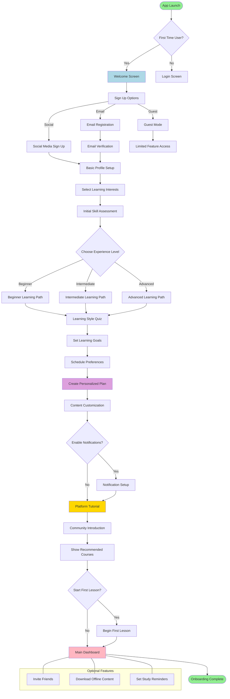

```mermaid
flowchart TD
    Start([App Launch]) --> FirstTime{First Time User?}
    FirstTime -->|Yes| Welcome[Welcome Screen]
    FirstTime -->|No| Login[Login Screen]
    
    Welcome --> SignUpOptions[Sign Up Options]
    SignUpOptions --> |Email| EmailSignUp[Email Registration]
    SignUpOptions --> |Social| SocialSignUp[Social Media Sign Up]
    SignUpOptions --> |Guest| GuestMode[Guest Mode]
    
    EmailSignUp --> Verification[Email Verification]
    SocialSignUp --> ProfileSetup[Basic Profile Setup]
    GuestMode --> LimitedAccess[Limited Feature Access]
    
    Verification --> ProfileSetup
    ProfileSetup --> InterestSelection[Select Learning Interests]
    
    InterestSelection --> SkillAssessment[Initial Skill Assessment]
    SkillAssessment --> ExperienceLevel{Choose Experience Level}
    
    ExperienceLevel -->|Beginner| BeginnerPath[Beginner Learning Path]
    ExperienceLevel -->|Intermediate| IntermPath[Intermediate Learning Path]
    ExperienceLevel -->|Advanced| AdvancedPath[Advanced Learning Path]
    
    BeginnerPath --> LearningStyle[Learning Style Quiz]
    IntermPath --> LearningStyle
    AdvancedPath --> LearningStyle
    
    LearningStyle --> GoalSetting[Set Learning Goals]
    GoalSetting --> SchedulePreference[Schedule Preferences]
    
    SchedulePreference --> PersonalizedPlan[Create Personalized Plan]
    PersonalizedPlan --> ContentCustomization[Content Customization]
    
    ContentCustomization --> Notifications{Enable Notifications?}
    Notifications -->|Yes| NotifSetup[Notification Setup]
    Notifications -->|No| Tutorial
    NotifSetup --> Tutorial[Platform Tutorial]
    
    Tutorial --> CommunityIntro[Community Introduction]
    CommunityIntro --> RecommendedCourses[Show Recommended Courses]
    
    RecommendedCourses --> FirstLesson{Start First Lesson?}
    FirstLesson -->|Yes| BeginLesson[Begin First Lesson]
    FirstLesson -->|No| Dashboard[Main Dashboard]
    BeginLesson --> Dashboard
    
    Dashboard --> Complete([Onboarding Complete])
    
    subgraph Optional Features
    FriendInvite[Invite Friends]
    DownloadContent[Download Offline Content]
    SetReminders[Set Study Reminders]
    end
    
    Dashboard --- FriendInvite
    Dashboard --- DownloadContent
    Dashboard --- SetReminders
    
    style Start fill:#90EE90
    style Complete fill:#90EE90
    style Dashboard fill:#FFB6C1
    style Welcome fill:#ADD8E6
    style Tutorial fill:#FFD700
    style PersonalizedPlan fill:#DDA0DD
```